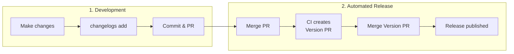

# changelogs

A Rust rewrite of [changesets](https://github.com/changesets/changesets) for Cargo workspaces.

## Installation

```bash
cargo install changelogs
```

## Quick Start

```bash
# Initialize changelogs in your workspace
changelogs init

# Add a changelog for your changes
changelogs add

# See what would be released
changelogs status

# Apply version bumps and generate changelogs
changelogs version
```

## Workflow



1. **Make changes** to your code
2. **Run `changelogs add`** to describe your changes
3. **Commit** the changelog file with your PR
4. **Merge** your PR
5. CI automatically creates a "Version Packages" PR
6. **Merge** the Version PR → Release published

## Demo

| Step | Link |
|------|------|
| Developer opens PR with a changelog file | [#1](https://github.com/wevm/changelogs-rs/pull/TODO_PR1) |
| PR merged → CI creates "Version Packages" PR | [#2](https://github.com/wevm/changelogs-rs/pull/TODO_PR2) |
| Version PR merged → Release published | [v0.0.2](https://github.com/wevm/changelogs-rs/releases/tag/TODO_TAG) |

## Commands

| Command | Description |
|---------|-------------|
| `init` | Initialize `.changelog/` directory |
| `add` | Create a new changelog interactively |
| `status` | Show pending changelogs and releases |
| `version` | Apply version bumps and update changelogs |
| `publish` | Publish unpublished packages to crates.io |

## Configuration

`.changelog/config.toml`:

```toml
# How to bump packages that depend on changed packages
dependent_bump = "patch"  # patch, minor, or none

[changelog]
format = "per-crate"  # or "root"

# Fixed groups: all always share the same version
[[fixed]]
members = ["crate-a", "crate-b"]

# Linked groups: versions sync when released together  
[[linked]]
members = ["sdk-core", "sdk-macros"]

# Packages to ignore
ignore = []
```

## Changelog Format

`.changelog/brave-lions-dance.md`:

```markdown
---
my-crate: minor
other-crate: patch
---

Added new feature X that does Y.

Fixed bug Z in the parser.
```

## GitHub Action

```yaml
name: Release

on:
  push:
    branches: [main]

jobs:
  release:
    runs-on: ubuntu-latest
    steps:
      - uses: actions/checkout@v4
      - uses: dtolnay/rust-toolchain@stable
      - run: cargo install changelogs
      - uses: wevm/changelogs-rs@v1
        with:
          version: changelogs version
          publish: changelogs publish
          crate-token: ${{ secrets.CARGO_REGISTRY_TOKEN }}
        env:
          GITHUB_TOKEN: ${{ secrets.GITHUB_TOKEN }}
```

**The action automatically handles both versioning and publishing:**

1. **If changelogs exist** → Creates/updates a "Version Packages" PR
2. **If no changelogs** (PR was just merged) → Publishes unpublished packages to crates.io

### Action Inputs

| Input | Description | Default |
|-------|-------------|---------|
| `version` | Command to run for versioning | `changelogs version` |
| `publish` | Command to run for publishing | - |
| `crate-token` | Crates.io API token for publishing | - |
| `commit` | Commit message for version bump | `Version Packages` |
| `title` | Pull request title | `Version Packages` |
| `branch` | Branch name for the version PR | `changelog-release/main` |

### Action Outputs

| Output | Description |
|--------|-------------|
| `hasChangelogs` | Whether there are pending changelogs |
| `pullRequestNumber` | The PR number if created/updated |
| `published` | Whether packages were published |
| `publishedPackages` | JSON array of published packages |

## License

MIT OR Apache-2.0
