<p align="center">
  <picture>
    <source media="(prefers-color-scheme: dark)" srcset=".github/banner-dark.svg">
    <source media="(prefers-color-scheme: light)" srcset=".github/banner-light.svg">
    
  </picture>
</p>

<p align="center">
  Changelog management for Rust, Python, and TypeScript¹ workspaces.
  <br>
  <sub>¹ TypeScript support is coming soon.</sub>
</p>

## Quick Start

```bash
# Install changelogs
curl -sSL changelogs.sh | sh

# Initialize changelogs in your workspace
changelogs init

# Add a changelog for your changes
changelogs add

# See what would be released
changelogs status

# Apply version bumps and generate changelogs
changelogs version
```

## Workflows

```mermaid
flowchart LR
    subgraph Development
        A[Make Changes] --> B[Open PR]
        B --> C{Bot comments<br/>with changelog link}
        C --> D[Add changelog]
        D --> E[Merge PR]
    end
    subgraph Release
        E --> F[/RC PR created/]
        F --> G[Merge RC PR]
        G --> H[/📦 Packages released/]
    end
```



### Development

| # | Step | Description |
|:-:|:-----|:------------|
| 1 | Make changes & open PR | Implement your feature or fix |
| 2 | Bot comments on PR | Links to add/edit changelog (AI pre-fills if enabled) |
| 3 | Add changelog & merge | Changelog gets staged in `.changelog/` |

### Release

| # | Step | Description |
|:-:|:-----|:------------|
| 1 | Push to main | Triggers release workflow |
| 2 | RC PR created | Version bumps and changelog updates |
| 3 | Merge RC PR | Packages published, GitHub releases created |

## Installation

### Pre-built binaries (recommended)

```bash
curl -sSL https://changelogs.sh | sh
```

Or download directly from [GitHub Releases](https://github.com/wevm/changelogs/releases):

| Platform | Download |
|----------|----------|
| Linux (x86_64) | [changelogs-linux-amd64](https://github.com/wevm/changelogs/releases/latest/download/changelogs-linux-amd64) |
| macOS (Intel) | [changelogs-darwin-amd64](https://github.com/wevm/changelogs/releases/latest/download/changelogs-darwin-amd64) |
| macOS (Apple Silicon) | [changelogs-darwin-arm64](https://github.com/wevm/changelogs/releases/latest/download/changelogs-darwin-arm64) |

## Commands

| Command | Description |
|---------|-------------|
| `init` | Initialize `.changelog/` directory |
| `add` | Create a new changelog interactively |
| `add --ai "<command>"` | Generate changelog using AI (see [Supported AI Providers](#supported-ai-providers)) |
| `status` | Show pending changelogs and releases |
| `version` | Apply version bumps and update changelogs |
| `publish` | Publish unpublished packages to crates.io |

## Configuration

`.changelog/config.toml`:

```toml
# How to bump packages that depend on changed packages
dependent_bump = "patch"  # patch, minor, or none

[changelog]
format = "per-crate"  # or "root"

# Fixed groups: all always share the same version
[[fixed]]
members = ["crate-a", "crate-b"]

# Linked groups: versions sync when released together  
[[linked]]
members = ["sdk-core", "sdk-macros"]

# Packages to ignore
ignore = []
```

## Changelog Format

`.changelog/brave-lions-dance.md`:

```markdown
---
my-crate: minor
other-crate: patch
---

Added new feature X that does Y.

Fixed bug Z in the parser.
```

## Supported AI Providers

The `--ai` flag and GitHub Action `ai` input accept any CLI command that reads from stdin and outputs text. The diff is piped to the command, and the output becomes the changelog entry.

| Provider | Command | Required Secret | Install |
|----------|---------|-----------------|---------|
| Amp | `amp -x` | `AMP_API_KEY` | `npm install -g @sourcegraph/amp` |
| Claude Code | `claude -p` | `ANTHROPIC_API_KEY` | `npm install -g @anthropic-ai/claude-code` |
| OpenAI | `openai api chat.completions.create -m gpt-4o` | `OPENAI_API_KEY` | `pip install openai` |
| Gemini | `gemini` | `GOOGLE_API_KEY` | `npm install -g @anthropic-ai/gemini-cli` |


### Examples

```bash
# Using Amp
changelogs add --ai "amp -x"

# Using Claude
changelogs add --ai "claude -p"

```

## GitHub Actions

### Check Changelogs on PRs

Comments on PRs with changelog status. If no changelog exists and `ai` is provided, generates one and pre-fills the "Add changelog" link.

```yaml
name: Changelog

on:
  pull_request:
    types: [opened, synchronize]

jobs:
  changelog:
    runs-on: ubuntu-latest
    permissions:
      contents: write
    steps:
      - uses: actions/checkout@v4

      - run: npm install -g @sourcegraph/amp

      - uses: wevm/changelogs/check@master
        with:
          ai: 'amp -x'
        env:
          AMP_API_KEY: ${{ secrets.AMP_API_KEY }}
```

### Create RC PR or Release

Creates a release candidate PR when changelogs exist, or publishes packages when the RC PR is merged.

```yaml
name: Release

on:
  push:
    branches: [main]

jobs:
  release:
    runs-on: ubuntu-latest
    steps:
      - uses: actions/checkout@v4
      - uses: wevm/changelogs@master
        env:
          GITHUB_TOKEN: ${{ secrets.GITHUB_TOKEN }}
```

**The release action automatically handles both versioning and publishing:**

1. **If changelogs exist** → Creates/updates a "Version Packages" PR
2. **If no changelogs** (PR was just merged) → Publishes unpublished packages to crates.io

### Action Inputs

| Input | Description | Default |
|-------|-------------|---------|
| `branch` | Branch name for the version PR | `changelog-release/main` |
| `commit` | Commit message for version bump | `Version Packages` |
| `conventional-commit` | Use conventional commit format | `false` |
| `crate-token` | Crates.io API token for publishing (Rust) | - |
| `pypi-token` | PyPI API token for publishing (Python) | - |

### Action Outputs

| Output | Description |
|--------|-------------|
| `hasChangelogs` | Whether there are pending changelogs |
| `pullRequestNumber` | The PR number if created/updated |
| `published` | Whether packages were published |
| `publishedPackages` | JSON array of published packages |

## Ecosystem Notes

### Python

Changelogs supports Python packages using PEP 621 `pyproject.toml` files.

**Requirements:**
- `pyproject.toml` with `[project]` section containing `name` and `version`
- Static version (dynamic versions not supported)
- Semantic versioning (no PEP 440 epochs or local versions)
- `python -m build` and `twine` installed (`pip install build twine`)

**Limitations:**
- Single-package repos only (no Python monorepo support)
- PEP 621 only (no `setup.py` or `setup.cfg`)

## License

MIT OR Apache-2.0
