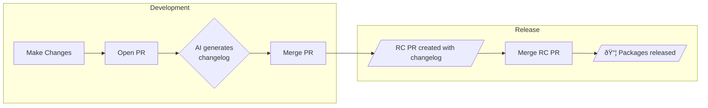

# changelogs

A Rust rewrite of [changesets](https://github.com/changesets/changesets) for Cargo workspaces.

## Quick Start

```bash
# Install changelogs
curl -sSL changelogs.sh | sh

# Initialize changelogs in your workspace
changelogs init

# Add a changelog for your changes
changelogs add

# See what would be released
changelogs status

# Apply version bumps and generate changelogs
changelogs version
```

## Workflows



### Development

1. Implement feature & **make changes** to your code
2. **Open a PR** to propose your changes
   1. Changelogs are auto-generated via AI (if `wevm/changelogs-rs/gen` action set up)
   2. Changelogs can be manually generated with `changelogs add`
3. **Merge the PR**
   1. Changelogs are kept in the `.changelog/` directory

### Release (Candidate)

1. **Pushes to main** trigger the Release Candidate workflow
2. **Workflow** creates or updates a Release Candidate PR with RC changelog
3. **Merge the PR** to release and publish the changelog

## Commands

| Command | Description |
|---------|-------------|
| `init` | Initialize `.changelog/` directory |
| `add` | Create a new changelog interactively |
| `add --ai "claude -p"` | Generate changelog using AI |
| `status` | Show pending changelogs and releases |
| `version` | Apply version bumps and update changelogs |
| `publish` | Publish unpublished packages to crates.io |

## Python Support

Changelogs supports Python packages using PEP 621 `pyproject.toml` files.

### Requirements

- **PEP 621 metadata**: Your `pyproject.toml` must have a `[project]` section with `name` and `version`
- **Static version**: Dynamic versions (`dynamic = ["version"]`) are not supported
- **Semantic versioning**: Versions must be valid semver (e.g., `1.2.3`, not PEP 440 epochs or local versions)
- **Build tools**: `python -m build` and `twine` must be installed

### Setup

```bash
# Install build dependencies
pip install build twine

# Initialize changelogs
changelogs init --ecosystem python
```

### Publishing

```bash
# Publish to PyPI (uses TWINE_USERNAME/TWINE_PASSWORD or ~/.pypirc)
changelogs publish
```

For CI, set `TWINE_USERNAME` and `TWINE_PASSWORD` environment variables (use `__token__` as username for API tokens).

### GitHub Actions for Python

```yaml
name: Release

on:
  push:
    branches: [main]

jobs:
  release:
    runs-on: ubuntu-latest
    steps:
      - uses: actions/checkout@v4
      
      - uses: actions/setup-python@v5
        with:
          python-version: '3.12'
      
      - run: pip install build twine
      
      - uses: wevm/changelogs-rs@master
        env:
          GITHUB_TOKEN: ${{ secrets.GITHUB_TOKEN }}
          TWINE_USERNAME: __token__
          TWINE_PASSWORD: ${{ secrets.PYPI_API_TOKEN }}
```

### Limitations

- Single-package repos only (no Python monorepo support)
- PEP 621 `pyproject.toml` only (no `setup.py` or `setup.cfg`)
- Semantic versioning only (no PEP 440 epochs, post releases, or local versions)

## Configuration

`.changelog/config.toml`:

```toml
# How to bump packages that depend on changed packages
dependent_bump = "patch"  # patch, minor, or none

[changelog]
format = "per-crate"  # or "root"

# Fixed groups: all always share the same version
[[fixed]]
members = ["crate-a", "crate-b"]

# Linked groups: versions sync when released together  
[[linked]]
members = ["sdk-core", "sdk-macros"]

# Packages to ignore
ignore = []
```

## Changelog Format

`.changelog/brave-lions-dance.md`:

```markdown
---
my-crate: minor
other-crate: patch
---

Added new feature X that does Y.

Fixed bug Z in the parser.
```

## GitHub Actions

### Auto-generate Changelogs on PRs

```yaml
name: Changelog

on:
  pull_request:
    types: [opened, synchronize]

jobs:
  changelog:
    runs-on: ubuntu-latest
    permissions:
      contents: write
    steps:
      - uses: actions/checkout@v4

      - run: npm install -g @sourcegraph/amp

      - uses: wevm/changelogs-rs/gen@master
        with:
          ai: 'amp -x'
        env:
          AMP_API_KEY: ${{ secrets.AMP_API_KEY }}
```

### Create RC PR or Release

```yaml
name: Release

on:
  push:
    branches: [main]

jobs:
  release:
    runs-on: ubuntu-latest
    steps:
      - uses: actions/checkout@v4
      - uses: wevm/changelogs-rs@master
        env:
          GITHUB_TOKEN: ${{ secrets.GITHUB_TOKEN }}
```

**The release action automatically handles both versioning and publishing:**

1. **If changelogs exist** → Creates/updates a "Version Packages" PR
2. **If no changelogs** (PR was just merged) → Publishes unpublished packages to crates.io

### Action Inputs

| Input | Description | Default |
|-------|-------------|---------|
| `crate-token` | Crates.io API token for publishing | - |
| `commit` | Commit message for version bump | `Version Packages` |
| `conventional-commit` | Use conventional commit format | `false` |
| `branch` | Branch name for the version PR | `changelog-release/main` |

### Action Outputs

| Output | Description |
|--------|-------------|
| `hasChangelogs` | Whether there are pending changelogs |
| `pullRequestNumber` | The PR number if created/updated |
| `published` | Whether packages were published |
| `publishedPackages` | JSON array of published packages |

## Installation

### Pre-built binaries (recommended)

```bash
curl -sSL https://raw.githubusercontent.com/wevm/changelogs-rs/master/install.sh | sh
```

Or download directly from [GitHub Releases](https://github.com/wevm/changelogs-rs/releases):

| Platform | Download |
|----------|----------|
| Linux (x86_64) | [changelogs-linux-amd64](https://github.com/wevm/changelogs-rs/releases/latest/download/changelogs-linux-amd64) |
| macOS (Intel) | [changelogs-darwin-amd64](https://github.com/wevm/changelogs-rs/releases/latest/download/changelogs-darwin-amd64) |
| macOS (Apple Silicon) | [changelogs-darwin-arm64](https://github.com/wevm/changelogs-rs/releases/latest/download/changelogs-darwin-arm64) |

### From source

```bash
cargo install changelogs
```

## License

MIT OR Apache-2.0
